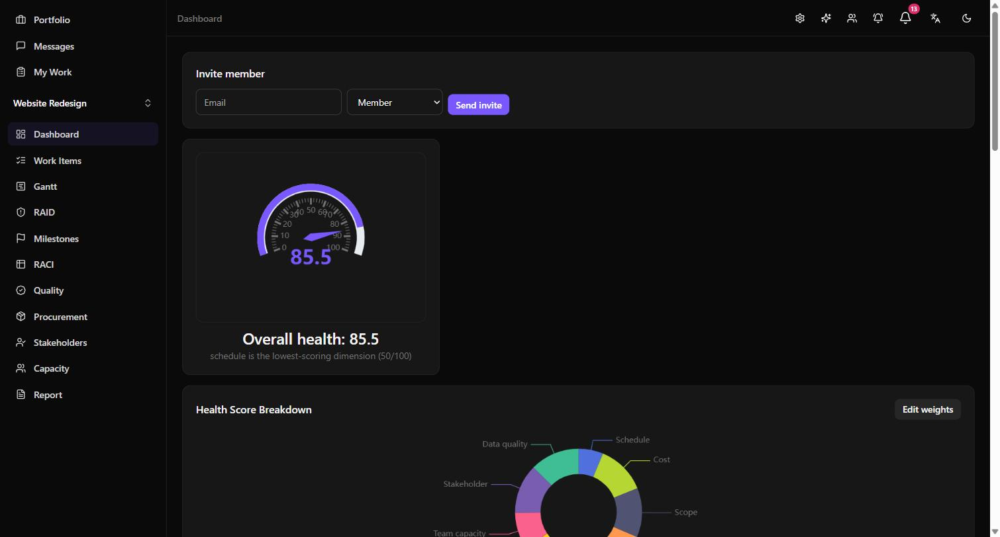
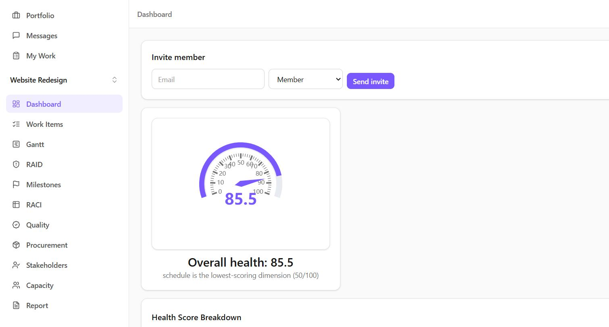
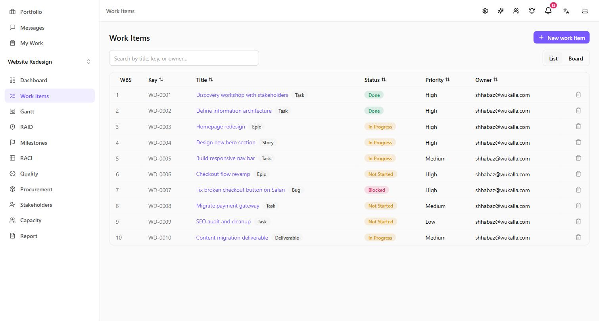
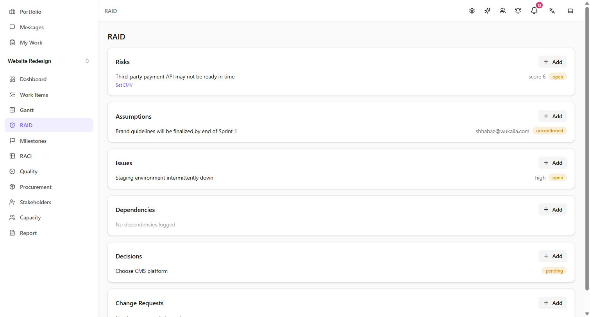
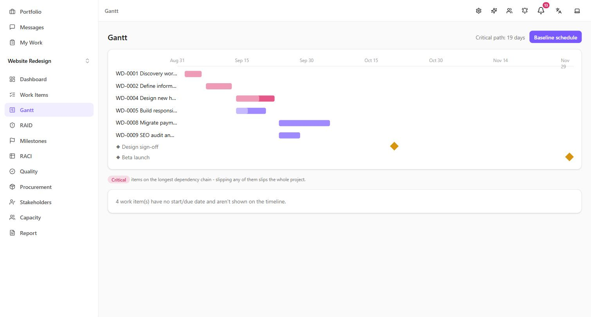
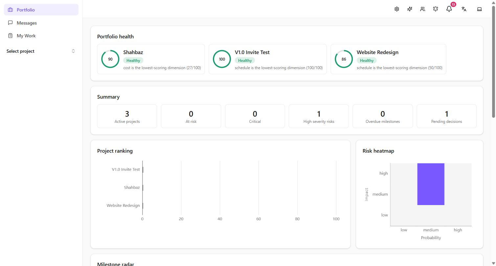
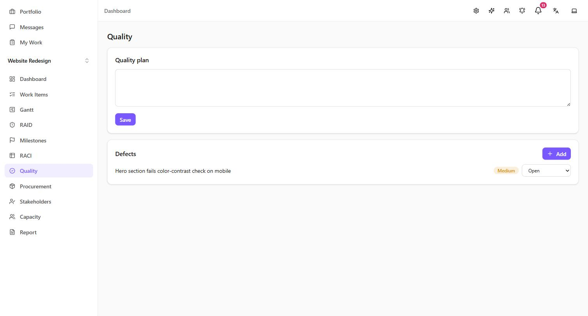

# nuskPM Desktop

**Turn the Excel or Google Sheet your team already uses into a real project delivery control system — installed in one click, no servers, no Docker, no setup.**

## Download

Grab the installer for your OS from the **[latest release](https://github.com/Shahbazhk/nuskpm-releases/releases/latest)**:

| OS | File | Install |
|---|---|---|
| **Windows** 10/11 (64-bit) | `nuskPM-Setup.exe` | Run it. Installs per-user — no administrator rights needed. |
| **macOS** | `nuskPM-<version>.dmg` | Open it and drag **nuskPM** into Applications. |
| **Linux** (Debian/Ubuntu, 64-bit) | `nuskpm_<version>_amd64.deb` | `sudo apt install ./nuskpm_<version>_amd64.deb` |

No prerequisites — no Python, Node, or Docker. The installer bundles everything nuskPM needs.

> **First launch warning?** The installers aren't code-signed yet, so Windows SmartScreen or macOS Gatekeeper may warn you the first time. On Windows choose **More info → Run anyway**; on macOS right-click the app and choose **Open**.

## Why this exists

Most small and mid-sized teams run projects out of a spreadsheet, a chat channel, and a pile of status emails. Enterprise PM tools promise to fix that, but they're often too expensive, too complex, or too prescriptive — forcing a specific methodology on a team that just wants visibility.

**nuskPM** takes a different approach: import the spreadsheet you already have, map a few columns, and get a live delivery dashboard in minutes. It blends predictive project controls (milestones, RAID, dependencies, earned value) with agile-friendly work tracking, and boils it all down to one explainable **Project Health Score** instead of a dozen disconnected charts.

The full nuskPM is a self-hosted web application, which is a great fit for a team but a lot to set up just to try it out or to run your own projects. **This desktop edition exists to remove that barrier:** install it like any other app and it runs entirely on your own computer. Your project data — client names, budgets, risks — is stored on your machine and never sent anywhere.

## How the desktop app works

- **Launch it and your browser opens.** nuskPM runs a small local server and opens the interface in your default browser. The first launch walks you through creating an administrator account.
- **System tray control panel (Windows & macOS).** nuskPM lives in your system tray, even with no browser tab open — see [The tray menu](#the-tray-menu) below. On Linux, nuskPM runs in a terminal window instead — keep it open while you work and close it to stop nuskPM.
- **Your data stays yours.** Everything lives in a per-user folder (see below), and uninstalling never deletes it.
- **Local only.** nuskPM listens on `127.0.0.1` (port `58731`, or the next free one), so it isn't reachable from other machines on your network.
- **Update notifications.** nuskPM checks this page for new releases and tells you when one is available. Updating is just running the newer installer over the top — it never touches your existing projects.

### The tray menu

Right-click the nuskPM icon (double-click opens the app). On Windows it may be hidden under the `^` overflow arrow — drag it onto the taskbar to keep it visible.

| Menu item | What it does |
|---|---|
| **nuskPM vX.Y.Z** / **● Running on http://127.0.0.1:58731** | Live version and status. |
| **Open nuskPM** | Opens the app in your browser. |
| **Stop nuskPM** / **Start nuskPM** | Stops or starts the local server. Your data is untouched. |
| **Restart nuskPM** | Stops and starts the server again. |
| **Update to vX.Y.Z** | Appears when a newer release exists. On Windows it downloads the installer, launches it and closes nuskPM so it can be replaced; on macOS/Linux it opens the release page. |
| **Check for Updates** | Checks for a newer release right now (nuskPM also checks at startup). |
| **Application Details** | Version, address, data folder, database file and log file at a glance. |
| **View Logs** | Opens `nuskpm.log` — startup messages and any errors. |
| **Open Data Folder** | Opens the folder holding your database and logs. |
| **Quit nuskPM** | Stops the server and removes the tray icon. |

> Want one shared instance for the whole team? The desktop app is for individuals and evaluation. For a shared team server, run the self-hosted (Docker) deployment of nuskPM instead.

## What you get

**Projects & import**
- Import work items from an `.xlsx`/`.csv` workbook or a Google Sheet URL: pick a sheet, map its columns, and see row-level validation errors before anything is created. Import history with one-click rollback, plus optional recurring sync for Google Sheets.
- Multi-project workspace; predictive, agile, or hybrid delivery approach per project. Archive/restore projects and clone any project as a template.

**Work management**
- Create and edit work items directly — types (task/story/bug/epic/deliverable), owners, priorities, estimates, sprints, dates, progress, epics and subtasks.
- List and Kanban board views, comments with @-mentions, full per-item change history, configurable per-project workflow statuses, and custom fields.
- Agile flow metrics: WIP, throughput, cycle time, oldest open items.

**Predictive PM toolkit**
- Work Breakdown Structure with automatic WBS codes and a WBS Dictionary.
- Gantt chart with critical-path highlighting, milestones, and schedule baselines with variance tracking.
- Cost management and Earned Value (PV/EV/AC/CPI/SPI/EAC/ETC/VAC/TCPI) on the dashboard.
- Quantitative risk analysis with expected monetary value and contingency reserve.
- Quality management (quality plan and defect register) and procurement management (vendors, bids, reviews).

**Control & governance**
- Full **RAID** register — Risks, **Assumptions**, Issues, Dependencies — plus Decisions and a Change Request log.
- RACI matrix and stakeholder register.
- **Project Health Score:** one explainable 0–100 score across nine dimensions (Schedule, Cost, Scope, Flow, Risk, Dependencies, Team, Stakeholder, Data Quality), so you can say *why* a project is red, not just that it is.
- Team capacity, and a portfolio dashboard once you have two or more projects.

**Reporting & communication**
- Ten report types (weekly status, executive summary, RAID, milestone forecast, workload, sprint, risk trend, decision aging, closure, full project export) as Markdown or Excel.
- In-app notifications, optional email notifications (bring your own SMTP), daily digests, and an audit log of who changed what.
- Built-in messaging with project channels, DMs, and groups.
- Optional AI assistant — bring your own OpenAI/Anthropic-compatible API key; answers are grounded only in your project's data.

**Everything else**
- Role-based access (Admin / PM / Team Lead / Member / Viewer), login lockout, and self-service password reset.
- Light / dark / system themes, five accent colors, English and Arabic with full right-to-left layout.
- One-click database backup from the admin page.

## Screenshots

| | |
|---|---|
|  Dashboard — health score, risks, milestones, decisions at a glance |  Work items — searchable, sortable, status at a glance |
|  The full RAID register, including Assumptions |  Gantt chart with critical-path highlighting |
|  Portfolio dashboard — health strip, ranking, risk heatmap |  Quality plan and defect register |

## Where your data lives

| OS | Location |
|---|---|
| Windows | `%APPDATA%\nuskPM` |
| macOS | `~/Library/Application Support/nuskPM` |
| Linux | `~/.local/share/nuskpm` |

The folder holds your database (`nuskpm.db`) and a generated secret key. To back up, use the backup option on the admin page inside nuskPM, or copy that folder while nuskPM is stopped. To move to another computer, install nuskPM there and copy the folder across.

## Updating and uninstalling

- **Update:** choose **Update to vX.Y.Z** from the tray menu, or download the newer installer from the [releases page](https://github.com/Shahbazhk/nuskpm-releases/releases/latest) and run it. Each release lists what changed. Your data is untouched.
- **Uninstall:** use your OS's normal uninstall. The data folder above is left in place on purpose; delete it yourself if you want everything gone.

## Troubleshooting

**nuskPM doesn't seem to open.** On Windows/macOS look for the nuskPM icon in the system tray (on Windows it may be under the `^` overflow arrow) and choose **Open nuskPM**. You can also browse to `http://127.0.0.1:58731/` directly.

**Something is wrong at startup.** Choose **View Logs** from the tray menu, or open the log files in your data folder (see above): `nuskpm.log` records startup output and errors (it's trimmed automatically), and `crash.log` is written if nuskPM fails to start. Include them when you report an issue.

**Fully quit nuskPM.** Use **Quit nuskPM** from the tray icon. If it's unresponsive, end the `nuskPM` process in Task Manager (Windows) or Activity Monitor (macOS) before reinstalling.

**Forgot the administrator password?** Use **Forgot password?** on the login page. Email reset needs SMTP configured in nuskPM's settings.

## Reporting problems

Open an [issue](https://github.com/Shahbazhk/nuskpm-releases/issues) with your OS, the nuskPM version (shown in the tray menu), and the log files mentioned above.
